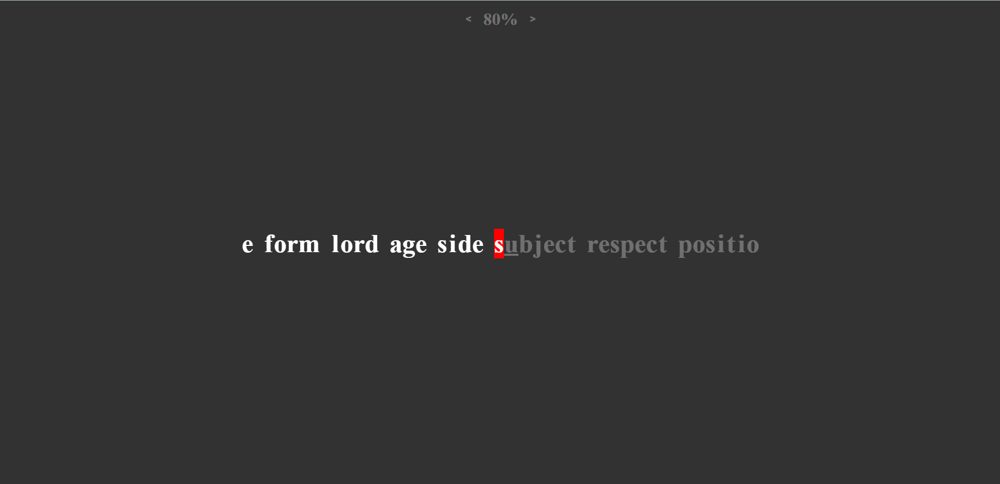

# Typing Trainer
### Typing trainer is a simple website made to help users improve their typing skills. It logs user's mistakes and targets them. The website allows the user to edit the training rate at the top of the screen. This option changes the amount that it targets weaknesses. It also tells the users what they are struggling with at the bottom of the screen.

